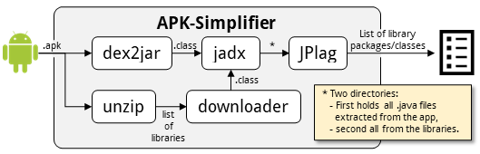
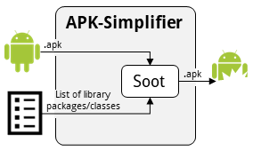



# APK-Simplifier
Android packages (.apk files) nowadays contain a large amount of (third-party) libraries.
APK-Simplifier allows to detect library classes that have not been tampered with.
To do so [JPlag](https://github.com/jplag/JPlag), a plagiarism checker (or clone detector), is used.
APK-Simplifier supports two phases:

1. **Parsing Phase:**
	- The input app is scanned for libraries.
	- Each library found is downloaded from a Google repository (e.g. https://dl.google.com/android/maven2/androidx/activity/activity/1.0.0/activity-1.0.0.aar).
	- The individual classes are extracted (and decompiled) from the library and from the app.
	- Both version of each seemingly same class are forwarded to JPlag to check if they are equal (or similar) up to a certain configurable threshold.
	- A list of *equal* and thereby *trusted* classes is output at the end of the first phase.



2. **Simplification Phase:**
	- The *trusted* library classes are removed from the app by employing [Soot](https://soot-oss.github.io/soot).
	- This step is performed via the SIMPLIFY operator of the [AQL-System](https://foellix.github.io/AQL-System/).



**!!!** Please note, the SIMPLIFY operator is not yet included in the AQL-System, however, it will be included with its next release. Same holds for the AQL-System dependency that denoted in this projects [pom.xml](pom.xml) **!!!**

## Building
Simply run Maven (`mvn`) inside the projects directory.  
Dependency AQL-System 2.0.1 no available, yet. Thus, please use the pre-compiled version (see [Releases](https://github.com/FoelliX/APK-Simplifier/releases)).

## Usage
**!!!** [Dex2Jar](https://github.com/pxb1988/dex2jar) must be installed and accessible. **!!!**

Before you are ready to simplify an app, please create or adapt the tool's configuration file (`simplifyParser.properties`).
Here is an example of its content:
```
dex2jarPath=/path/to/dex2jar/d2j-dex2jar
threshold=70.0
```
`dex2jarPath` must refer to the `d2j-dex2jar` executable of [Dex2Jar](https://github.com/pxb1988/dex2jar).
The value given as `threshold` is used as similarity score minimum - with respect to the given example, only library classes that are 70% or *more equal* are removed.

To finally execute the tool run:
```bash
java -jar SimplifyParser.jar app.apk [output.txt]
```
`app.apk` is a placeholder of the app you want to simplify.
The second parameter specifies the output file.
This parameter is optional - by default the file `output.txt` is created.

## Publications
- *Scaling Arbitrary Android App Analyses* (Felix Pauck)  
A-Mobileq@ASE 2022 (to appear)

## License
APK-Simplifier is licensed under the *GNU General Public License v3* (see [LICENSE](https://github.com/FoelliX/AQL-System/blob/master/LICENSE)).

# Contact
**Felix Pauck** (FoelliX)  
Paderborn University  
fpauck@mail.uni-paderborn.de  
[http://www.FelixPauck.de](http://www.FelixPauck.de)